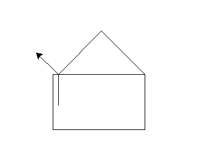

# Parle pour dessiner

<h2>Démarrage</h2>

```
python main.py
```

<h2>Commande vocal</h2>

<li> Donnez un angle </li>
<li> Donnez une distance </li>
<li> Dites stop pour arrêter </li>

<h2>Exemple</h2>
